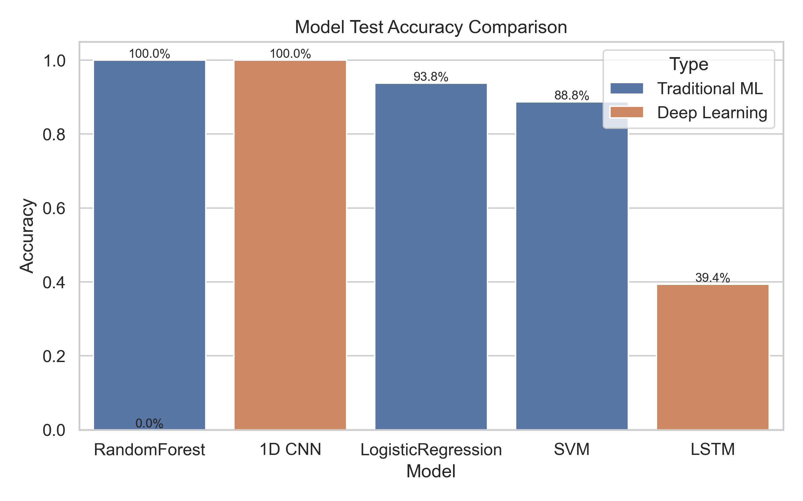
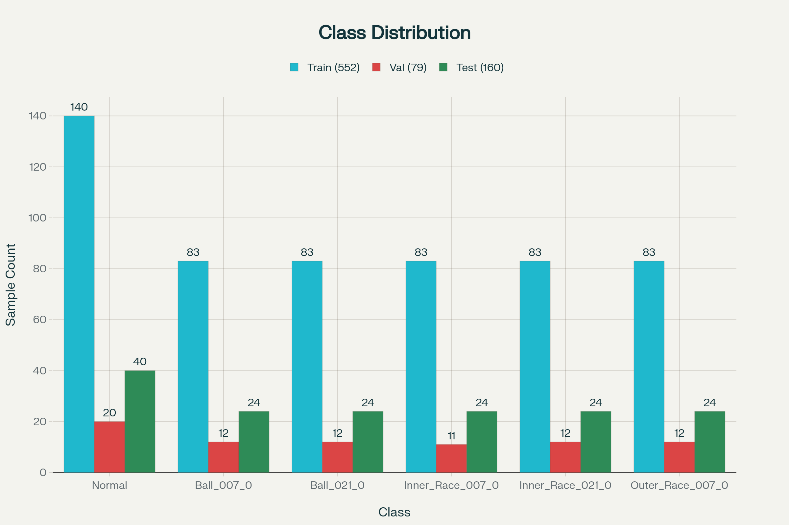

# Bearing Fault Diagnosis Project

Tools for classifying bearing faults from Case Western Reserve University (CWRU) 12 kHz drive-end vibration data. The repository contains data prep/training (via notebooks), saved model artifacts, prediction CSVs, and plotting utilities to evaluate traditional ML and deep learning models.




## What’s here
- `eel5825_project.ipynb`: end-to-end workflow (load raw `.mat`, segment, train/evaluate models).
- `plot_results.py`: generates metrics table plus accuracy, confusion matrix, ROC, training-curve, and feature-importance plots from saved CSVs.
- `config/parameters.yaml`: dataset files, preprocessing parameters, and model hyperparameters.
- `data/raw/`: CWRU drive-end `.mat` files referenced in the config.
> Get it from [the CWRU dataset repository](https://engineering.case.edu/bearingdatacenter/download-data-file)
- `data/processed/`: cached numpy arrays and `label_map.json`.
- `models/`: saved models (e.g., `randomforest.pkl`).
- `results/`: prediction CSVs, combined metrics, and `figures/` with generated PNGs.
- `cleanup`: helper script to clear models, processed data, and results for a clean run.


*Sample Distribution*

## Setup
1. Create and activate a Conda env (Python 3.10+):
   ```bash
   conda create -n eel5825 python=3.10 -y
   conda activate eel5825
   ```
2. Install dependencies:
   ```bash
   pip install -r requirements.txt
   ```
3. Ensure raw CWRU files listed in `config/parameters.yaml` are present under `data/raw/`. Adjust paths or filenames in the YAML if you use different splits or data.

## Reproduce training/evaluation
1. Open `eel5825_project.ipynb` and run the cells to:
   - Load raw signals and segment them (defaults: 1,024-sample windows, class-balanced sampling).
   - Train traditional ML models (Logistic Regression, RandomForest, SVM) on engineered time-domain features.
   - Train deep learning models (1D CNN, LSTM) on raw segments.
   - Write predictions to `results/traditional_predictions.csv` and `results/deep_learning_predictions.csv`, plus per-model probability CSVs.
2. Saved artifacts land in:
   - `data/processed/`: `signals.npy`, `labels.npy`, `label_map.json`
   - `models/`: trained estimators (e.g., `randomforest.pkl`)
   - `results/`: metrics and probability CSVs

## Generate reports and figures
Run the plotting utility after predictions exist:
```bash
python plot_results.py
```
It will create:
- `results/model_metrics.csv`: Accuracy, macro/weighted F1, and ROC-AUC (when probabilities are available).
- `results/figures/model_accuracy_comparison.png`: accuracy bar chart across all models.
- `results/figures/*_accuracy_history.png` and `*_loss_history.png`: deep model training curves.
- `results/figures/confusion_matrix_<Model>.png`: normalized confusion matrices.
- `results/figures/roc_curve_<Model>.png`: macro-average ROC curves for selected models (defaults: RandomForest, 1D CNN).
- `results/figures/randomforest_feature_importances.png`: feature importances for the traditional pipeline.

## Configuration notes
- Edit `config/parameters.yaml` to change sampling rates, segment length, dataset files, train/val/test splits, or model hyperparameters.
- Class labels are defined in `data/processed/label_map.json`; the default mapping is:
  - 0: Normal
  - 1: Ball_007_0
  - 2: Ball_021_0
  - 3: Inner_Race_007_0
  - 4: Inner_Race_021_0
  - 5: Outer_Race_007_0

## Results snapshot (current artifacts)
- Combined test accuracy (from `results/combined_results.csv`): RandomForest and 1D CNN at 1.00; Logistic Regression at 0.94; SVM at 0.89; LSTM underperforms on this setup.
- Figures live in `results/figures/` for quick inspection.

## Housekeeping
- To reset generated artifacts while keeping raw data:
  ```bash
  ./cleanup
  ```
- License: see [`LICENSE`](LICENSE).
